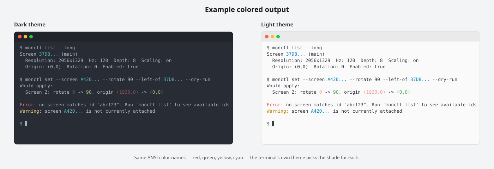

# monctl CLI Modernization

**Status:** Draft

## Summary

monctl inherited its command-line interface unchanged from [displayplacer](https://github.com/jakehilborn/displayplacer): a single positional argument encoding a small `key:value` domain-specific language (DSL). This document proposes replacing that interface with a conventional flag- and subcommand-based CLI, informed by established CLI design guidelines, while preserving the workflows monctl's users actually rely on. monctl has no existing users, so the redesign is not constrained by backward compatibility.

## 1. Background and problem statement

Today, applying a display configuration means constructing a quoted string by hand, e.g.:

```
monctl "id:<screenId> res:<width>x<height> hz:<num> color_depth:<num> scaling:<on/off> origin:(<x>,<y>) degree:<0/90/180/270>"
```

This design has several concrete problems:

- **Not discoverable.** There are no real flags — everything is packed into a string the user has to already know how to write. Shell completion is impossible, since the shell only ever sees one opaque argument.
- **Fragile syntax.** Quoting, spacing, and `+`-joined mirror IDs are easy to get wrong; mistakes surface as parser errors rather than pointing at the offending token.
- **No machine-readable output.** `monctl list` prints prose intended for a human to copy back into another `monctl` invocation. There is no `--json`, so scripting against it means regex-parsing display output.
- **Help text is undifferentiated.** `HelpText.swift` is a single discussion string covering usage, setup instructions, screen-id caveats, and notes all at once, rather than the layered short-help/long-help/docs structure tools like [`git`](https://git-scm.com/) or [`gh`](https://cli.github.com/) use.
- **Error handling is ad hoc.** Errors are printed via a bespoke `eprint` helper with a bare exit code; there is no consistent message shape, no suggested fixes, and no per-screen error attribution beyond a `quiet:true` flag.
- **The one real "profile" workflow is copy-pasted string.** The README instructs users to run `monctl list`, copy the printed args, and paste them into [Automator](https://support.apple.com/guide/automator/welcome/mac) or [BetterTouchTool](https://folivora.ai/) hotkeys. This is the primary daily workflow for most users, and it is implemented as string copying rather than as a first-class concept.
- **`list` output is unbounded.** [ScreenLister.swift:51-68](../Sources/monctl/ScreenLister.swift#L51-L68) unconditionally prints every display mode for every screen. A HiDPI external monitor commonly reports 30-60+ resolution/hz/depth/scaling combinations, so with two or three screens attached, `monctl list` output runs well past 100 lines, with the one line of interest (the current mode) buried in the middle.

## 2. Prior art and research

This proposal is grounded in the [Command Line Interface Guidelines](https://clig.dev) and the [Heroku CLI style guide](https://devcenter.heroku.com/articles/cli-style-guide), plus conventions established by [`git`](https://git-scm.com/), [`docker`](https://www.docker.com/), [`kubectl`](https://kubernetes.io/docs/reference/kubectl/), [`gh`](https://cli.github.com/), and [`xrandr`](https://www.x.org/releases/X11R7.7/doc/man/man1/xrandr.1.xhtml) (the tool monctl's own README describes it as the macOS equivalent of). The points most relevant to monctl:

- **Prefer flags over positional DSLs.** Flags are self-documenting, order independent, and completable. Positional arguments are appropriate only for single, obvious values (`cp src dst`), not for encoding an entire config object as a string.
- **Human-readable output by default; machine-readable output opt-in.** Default output should read well in a terminal. A `--json` flag (and often `--plain`/`--terse`) should give scripts something stable to parse instead of scraping prose.
- **Layer the help text.** Short help by default (purpose, one example, common flags); `--help` for the full picture; long-form docs (README, man page) for everything else. Avoid a single undifferentiated block.
- **Use subcommands for discoverability**, with consistent verb/noun ordering and no ambiguous overlapping names. Heroku's `topic:command` convention and git's `noun verb` convention both work; the important part is consistency.
- **Separate stdout and stderr.** Primary output (data) goes to stdout; status, progress, and errors go to stderr. Exit 0 on success, non-zero on failure, always.
- **Rewrite errors for humans**, and suggest a fix where one can be inferred (e.g. "no screen matches id `abc123` — run `monctl list` to see available ids") rather than surfacing a raw parser failure.
- **Respect [`NO_COLOR`](https://no-color.org) and detect TTY**, disabling color and animation when output is piped.
- **Maintain appropriate information density.** clig.dev states this directly: "A command is saying too much when it dumps pages and pages of debugging output." It recommends piping long output through a pager (`less`), and gating detail that's "only understandable by the creators of the software" behind a verbose or opt-in flag rather than printing it unconditionally. This applies directly to the `list` mode-dump problem in §1 — the fix is a compact default with detail available on request, not the removal of that detail.
- **Confirm or dry-run operations with real consequences.** Changing display configuration can black out a screen or disconnect the one the user is working on; clig.dev classifies this as the kind of moderate-danger operation that warrants a `--dry-run` or preview step.
- **Default to grep-parseable columns, not a table-rendering library.** Heroku's guide recommends a column-aligned table a human can scan and a script can still `grep`/`awk`, with `--json` as the escape hatch for anything structured. This is a formatting convention, not a dependency — it does not require a TUI/table framework (e.g. Python's [Textual](https://github.com/Textualize/textual)) to implement, and monctl remaining a single static binary with no runtime dependencies is worth preserving.
- **xrandr already solved the "one resolution, many refresh rates" problem.** Its mode listing prints each resolution once, then lists its supported refresh rates indented underneath it, rather than repeating the resolution per rate. Worth adopting directly rather than re-deriving.
- **xrandr also solved raw-coordinate placement.** Rather than requiring users to compute pixel offsets by hand, xrandr provides relative placement flags — `--right-of`, `--left-of`, `--above`, `--below`, `--same-as` (mirroring) — alongside a raw `--pos <x>x<y>` for cases the relative flags cannot express. This mirrors clig.dev's general guidance on flags: give the common case a legible name, and keep the raw primitive available for advanced use.

### 2.1 Feature and UX comparison: monctl (proposed) vs xrandr

xrandr is a good model for flag design but a weaker model for output/scripting ergonomics, which is why this proposal borrows the former and adds `--json`/`profile` on top rather than matching xrandr 1:1:

| Aspect | xrandr | monctl (proposed) |
| --- | --- | --- |
| Command structure | Single flat command, no subcommands; multi-screen changes are repeated `--output` blocks in one invocation | Subcommands (`list`, `set`, `profile`) with verb/noun grouping, per the subcommand-discoverability guidance above |
| Screen identifiers | Real port names (`eDP-1`, `HDMI-1`, `DP-2`) | Three id types — persistent, contextual, serial — because macOS exposes no single stable identifier (§4.3) |
| Mode listing | Each resolution printed once, refresh rates indented underneath, current marked `*`, preferred `+` | Same compact-then-detailed shape: `list` shows only the current mode, `--long` adds the full indented per-resolution mode list (§4.3) |
| Relative placement | `--left-of`, `--right-of`, `--above`, `--below`, `--same-as`, computed from output geometry; `--pos <x>x<y>` for raw coordinates | Adopts the same flags directly, plus `--origin x,y` for the advanced/raw case (§4.2) |
| Machine-readable output | None built-in; scripts parse `xrandr --query` text | `--json` on `list`/`profile show`/`profile list`, always full-fidelity regardless of `--long` (§4.3, §5) |
| Saved layouts | None; users hardcode flags per layout in their own shell scripts | First-class `profile save`/`apply`/`list`/`show`/`rm`/`edit`, stored as JSON under XDG config (§4.1) |
| Dry-run / confirmation | None | `--dry-run` on `set` and `profile apply` (§4.1; whether to make it the default is an open question in §6) |
| Disabling a screen | `--off` | `--enabled true|false` |
| Filtering mode queries | None — always dumps every mode for the output | `--long --screen <id> --resolution WxH` narrows to one screen's or one resolution's hz/depth/scaling combos (§4.3) |
| Shell completion | Standard flag parsing; no dedicated subcommand | `monctl completion <shell>` |

## 3. Goals

1. Preserve the workflow users actually rely on — applying a full multi-screen layout in one operation — as a first-class, named concept rather than a copy-pasted string.
2. Express single-screen adjustments (rotate one screen, change its resolution) as real flags rather than a hand-written DSL fragment.
3. Provide scripts and hotkey tools (Automator, BetterTouchTool, [Raycast](https://www.raycast.com/)) a stable `--json` output and a stable way to invoke a saved layout, instead of requiring a string embedded in the hotkey configuration.

monctl has no existing users, so none of the above is constrained by backward compatibility: the legacy positional DSL can be dropped outright rather than retained as a compatibility shim.

## 4. Proposed design

### 4.1 Command surface

```
monctl list                      # compact table: one row per screen, common fields only
monctl list --long               # full per-screen detail: all screen ids, type, exact depth, full mode list (today's behavior), piped through $PAGER
    --screen <id>                # scope --long to a single screen
    --resolution WxH             # scope the mode list to a single resolution's hz/depth/scaling combos
monctl list --json               # machine-readable screen info, always includes every field + full mode list

monctl set --screen <id> [flags]  # apply config to a single screen
    --resolution WxH
    --mode <num>
    --hz <num>
    --depth <num>
    --scaling on|off
    --right-of <id>              # relative placement, computed from <id>'s current bounds
    --left-of <id>
    --above <id>
    --below <id>
    --origin x,y                 # advanced: raw pixel origin, for layouts relative placement can't express
    --rotate 0|90|180|270
    --mirror <id>[,<id>...]
    --enabled true|false
    --dry-run                    # print what would change, do nothing
    --quiet                      # don't error if <id> isn't currently attached

monctl profile save <name>        # capture the current layout (from `list`) under a name
monctl profile apply <name>       # apply a saved layout, atomically, across all its screens
    --dry-run                    # print the diff, don't apply, don't prompt
    # confirms by default (colored diff + yellow prompt, per §5); MONCTL_PROFILE_APPLY_NO_CONFIRM=1 skips the prompt for hotkey tools
monctl profile list                # list saved profiles
monctl profile show <name>         # print a saved profile (human or --json)
monctl profile rm <name>
monctl profile edit <name>         # open the profile file in $EDITOR

monctl completion <shell>          # shell completion script (free from swift-argument-parser)
```

**Rationale for splitting `set` (one screen) from `profile apply` (a whole layout):** the current single-string design conflates two distinct operations — adjusting one screen, and restoring an entire desk arrangement. Flags suit the former; a saved, named, structured layout suits the latter far better than one large quoted string. This also replaces the README's current guidance to copy-paste `monctl list` output into a hotkey tool: a hotkey would instead invoke `monctl profile apply docked`.

Profiles would be stored as JSON under `~/.config/monctl/profiles/<name>.json` ([XDG-style](https://specifications.freedesktop.org/basedir-spec/basedir-spec-latest.html)), human-editable, and diffable in a dotfiles repository — an improvement over an opaque one-line string embedded in an Automator action.

### 4.2 Positioning: relative flags by default, raw origin for advanced cases

`origin:(x,y)` in the current DSL is a pixel coordinate in macOS's shared virtual-desktop space, describing where a screen's top-left corner sits relative to every other screen. Requiring users to compute this by hand — placing one screen "to the right" of another requires knowing that screen's exact width — is exactly the kind of computation flags should absorb. `--right-of`/`--left-of`/`--above`/`--below <id>` cover the common case by computing the origin from the referenced screen's current bounds; `--origin x,y` remains available directly for cases relative placement cannot express, such as partial overlap, vertically centering screens of different heights, or staggered arrangements.

### 4.3 Detail levels: compact, `--long`, and `--json`

Today's `list` prints every field for every screen unconditionally: three separate screen ids (persistent, contextual, serial), type, resolution, hz, exact color depth, scaling, origin, rotation, and enabled state, the full per-screen mode list — plus a usage-example command embedded in the rotation line. This proposal splits these by how often each is actually needed:

- **Compact (`monctl list`)** retains only what is checked day to day: which screen is which (persistent id plus a main-display marker), type, resolution, hz, scaling, origin, rotation, and enabled state.
- **`--long`** adds the contextual and serial ids, the exact color depth, and the full per-screen mode list (today's behavior), piped through `$PAGER`. These matter specifically when the persistent id is misbehaving (see the README's "ScreenIds Switching" section), when debugging a color/depth issue, or when picking an exact mode to set — not on every invocation. The three id types exist because no single macOS identifier is reliable in every situation, which is worth stating explicitly alongside the existing "which one to use" guidance:
  - The **persistent id** is a UUID tied to a display-and-port combination that macOS attempts to keep stable across reboots and sleep, but that can still be reassigned by hotplug race conditions.
  - The **contextual id** is the raw, session-scoped display handle the current WindowServer session assigned; it resets on GPU switches or reboots, but is sometimes more reliable within a single session.
  - The **serial id** comes from the monitor's own EDID hardware serial number, so it is independent of port, GPU, and session — but useful only if that serial number is actually unique, which is not guaranteed on lower-cost displays.
- **`--json`** always includes every field regardless of `--long`, since scripts should not need to guess which detail level to request.
- The embedded rotate-example command (`` `displayplacer "id:... degree:90"` ``) is removed from data output entirely and moves to `monctl set --help` or the README — it is a usage note, not a fact about the screen's current state, and repeating it on every `list` invocation is the same help-text-in-data-output problem as the mode dump described in §1.
- **`--long` accepts `--screen <id>` and `--resolution WxH` filters**, for the common question "what refresh rates/depths are available at resolution X on this screen?" without scrolling past every other mode. `--screen` narrows the whole `--long` output to one screen; `--resolution` further narrows its mode list to the hz/depth/scaling combos for that one resolution. Both reuse the exact flag names `set` takes, so a filtered `--long` result can be applied directly: find the combo with `list --long --screen A420... --resolution 2560x1440`, then run `set --screen A420... --resolution 2560x1440 --hz <the one you picked>`.

### 4.4 Example session

```
$ monctl list
ID       MAIN  TYPE      RESOLUTION  HZ   SCALING  ORIGIN     ROTATE  ENABLED
37D8...  *     built-in  2056x1329   120  on       (0,0)      0       true
A420...        27in ext  2560x1440   60   off      (1920,0)   0       true

$ monctl list --long
Screen 37D8832A-2D66-02CA-B9F7-8F30A301B230 (main)
  Contextual id: 1
  Serial id: s4251086178
  Type: built-in
  Resolution: 2056x1329  Hz: 120  Depth: 8  Scaling: on
  Origin: (0,0)  Rotation: 0  Enabled: true
  Modes:
    5120x2880
      hz:60 depth:8 scaling:on
      hz:60 depth:8
    4096x2304
      hz:60 depth:8 scaling:on
      hz:60 depth:8
    ...
    1280x800
      hz:60 depth:8 scaling:on
    1024x768
      hz:60 depth:8 <-- current mode

Screen A420... (id: A420...)
  Contextual id: 2
  Serial id: s9876543210
  Type: 27in external
  Resolution: 2560x1440  Hz: 60  Depth: 8  Scaling: off
  Origin: (1920,0)  Rotation: 0  Enabled: true
  Modes:
    2560x1440
      hz:60 depth:8 scaling:on <-- current mode
      hz:60 depth:8
    ...
    1024x768
      hz:60 depth:8

$ monctl list --long --screen A420... --resolution 2560x1440
Screen A420... (id: A420...)
  Modes:
    2560x1440
      hz:60 depth:8 scaling:on <-- current mode
      hz:60 depth:8

$ monctl set --screen A420... --rotate 90 --left-of 37D8...
Applied: Screen 2 now 1440x2560 @60hz, origin (0,0), rotated 90°

$ monctl set --screen A420... --rotate 90 --origin 0,0   # equivalent, spelled out with the advanced flag
Applied: Screen 2 now 1440x2560 @60hz, origin (0,0), rotated 90°

$ monctl profile save docked
Saved profile "docked" (2 screens) to ~/.config/monctl/profiles/docked.json

$ monctl profile apply docked --dry-run
Would apply profile "docked":
  Screen 1: no change
  Screen 2: rotate 0 -> 90, origin (1920,0) -> (0,0)
```

## 5. Output and error conventions

- `list`, `profile show`, and `profile list` support `--json` for scripting; default output remains human-readable prose/table, and `--json` always includes every field regardless of `--long`.
- `list` defaults to a compact table (common fields, current mode only); `--long` adds the rarely-needed fields (alternate screen ids, exact depth) and the full per-mode dump, piped through `$PAGER` (falling back to `less`) when writing to a TTY, per the information-density guidance in §2. `--long` also accepts `--screen <id>` and `--resolution WxH` to filter the dump down to one screen and/or one resolution's hz/depth/scaling combos, using the same flag names `set` takes.
- All data is written to stdout; status messages (e.g. "Applied: ...", "Saved profile ...") and all errors are written to stderr.
- Errors are a single line, prefixed `Error:`, phrased in plain language, with a suggested fix when one can be inferred: `Error: no screen matches id "abc123". Run 'monctl list' to see available ids.`
- Exit codes: `0` on success, `1` on generic failure, `2` on a usage/parse error — matching [swift-argument-parser](https://github.com/apple/swift-argument-parser)'s existing default behavior.
- Color is used only for emphasis, never as the sole conveyor of information, and is disabled automatically when stdout is not a TTY or when `NO_COLOR`/`--no-color` is set:
  - Screen ids in `list`/`list --long` are cyan, since the id is the primary key a user copies into a follow-up `set`/`profile` command.
  - Errors are red, warnings are yellow.
  - `set` and `profile apply --dry-run` color their diff like `git diff` does: the old value dim/red, the new value green (e.g. `rotate 0 -> 90` with `0` dim and `90` green), since that's the one output a user is specifically scanning for "what's about to change."
  - Colors use the 8 standard ANSI SGR codes, not 256-color/truecolor escapes, and avoid the bold/bright variants. A plain ANSI color name (`red`, `green`, `cyan`, `yellow`) is a request to the terminal, not a fixed RGB value — the terminal's own theme decides the actual shade, which is what keeps these readable against both dark and light backgrounds without monctl special-casing either. A hardcoded hex/truecolor red or a bright/bold variant instead risks low contrast against a light-theme background (e.g. bright yellow on white) that monctl has no way to detect or correct for.
  - Example rendering of this scheme under both a dark and a light terminal theme:

    

## 6. Open questions

- Subcommand naming: `monctl set` versus something more specific such as `monctl configure` or `monctl screen set`. `set` is short but somewhat generic.
  - `set` is good for now
- Is `profile` the right noun, or would `layout`/`arrangement` fit better given the "arrange displays" framing in the README's tagline?
  - `profile` is good for now
- Should `monctl set` support configuring more than one screen per invocation (repeated `--screen` blocks), or should that remain exclusively `profile apply`'s responsibility, keeping `set` strictly single-screen?
  - only one screen for now
- Should `profile apply` require `--dry-run` confirmation by default on first use, or only when explicitly requested? Rotating or disabling the screen currently in use is the main failure mode to guard against.
  - Resolved: `profile apply` prints a diff (same colored old→new format as `--dry-run`, see §5) and prompts for confirmation by default, every time, not just first use — since the risky screens can differ across profiles or hotplug state, "first use" alone doesn't cover repeat risk. The confirmation prompt itself is yellow (the existing warning color, per §5) to draw the eye before the user hits enter. Set `MONCTL_PROFILE_APPLY_NO_CONFIRM=1` to skip the prompt and apply immediately, for hotkey tools (Automator, BetterTouchTool) that can't answer an interactive prompt. `--dry-run` remains available separately at any time, on or off that env var, purely to preview without applying.
- Is there interest in an interactive `monctl arrange` (prompt-driven) mode for first-time setup, or should monctl remain strictly a scripting/hotkey-first tool?
  - Skip for now

## 7. References

- [Command Line Interface Guidelines](https://clig.dev)
- [Heroku CLI Style Guide](https://devcenter.heroku.com/articles/cli-style-guide)
- [NO_COLOR](https://no-color.org)
- [XDG Base Directory Specification](https://specifications.freedesktop.org/basedir-spec/basedir-spec-latest.html)
